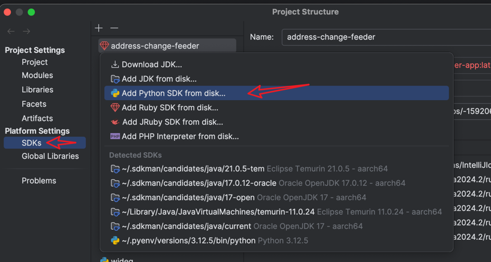
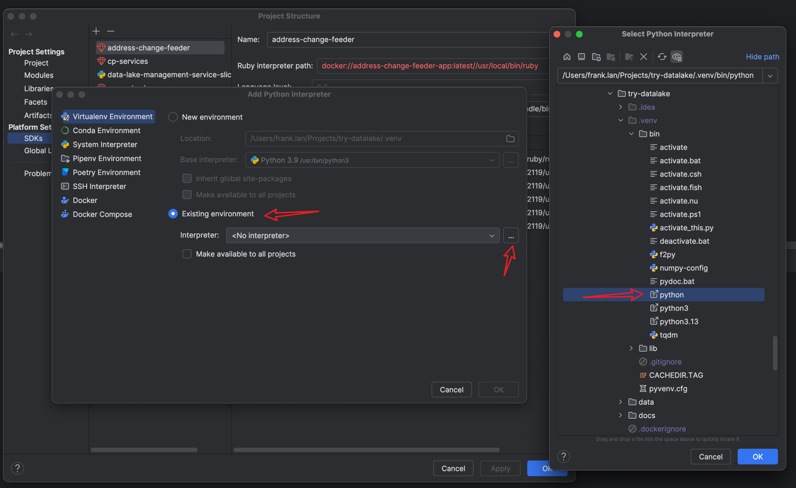
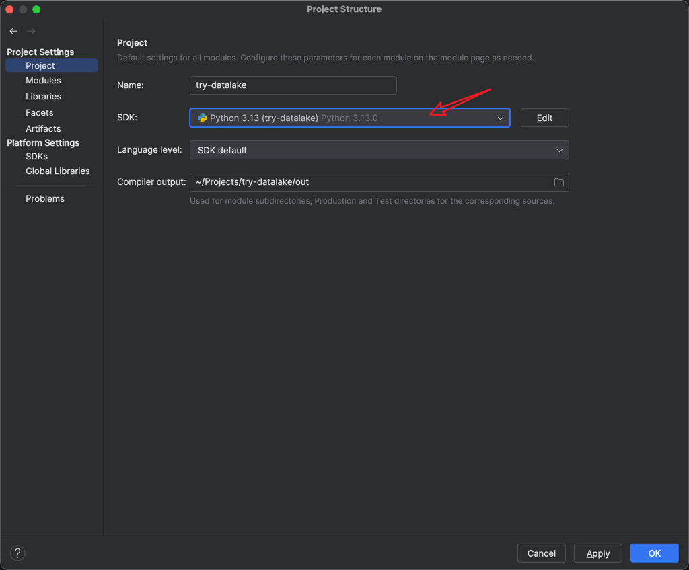
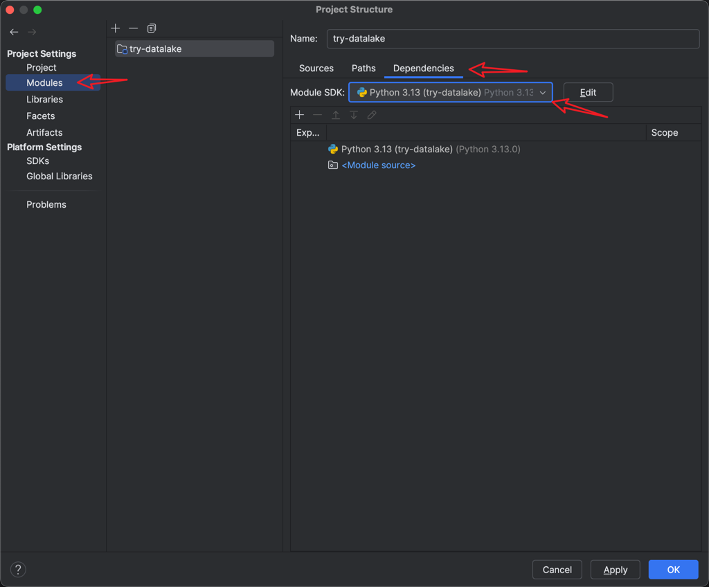

1. Install `uv` follow [this](https://github.com/astral-sh/uv?tab=readme-ov-file#installation) or simply run `brew install uv`. `uv` managed both python version and dependencies.
2. Run `uv sync`. This should create a virtual environment in the `.venv` folder and install all dependencies.
3. In IntelliJ IDEA, go to `File -> Project Structure -> Project Settings -> SDKs`.
4. 
5. 
6. 
7. 
